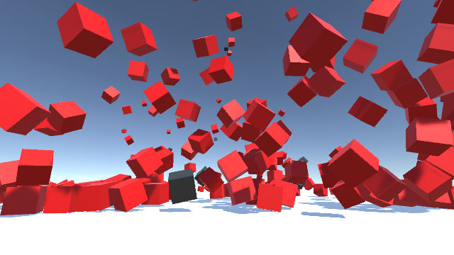

# Unity object pool

Simple object pooling system for Unity3D.

- OnActive : Process when active.
- OnDeactive : Process when deactive.
- OnDestroyObject : Process when destory object.

## How to use

Import [ObjectPool.unitypackage](ObjectPool.unitypackage) into your project.

For more information please look at Assets/Samples/Scenes/Sample.unity
